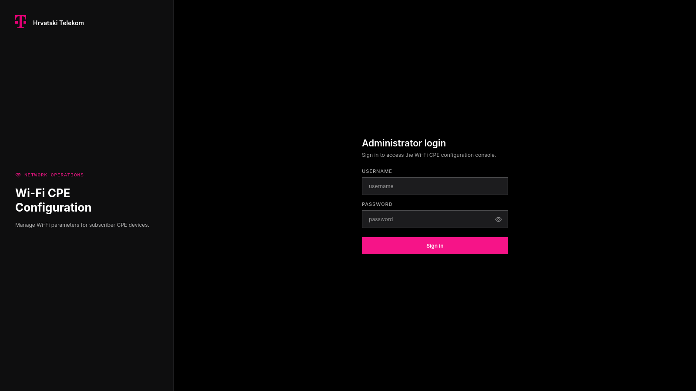
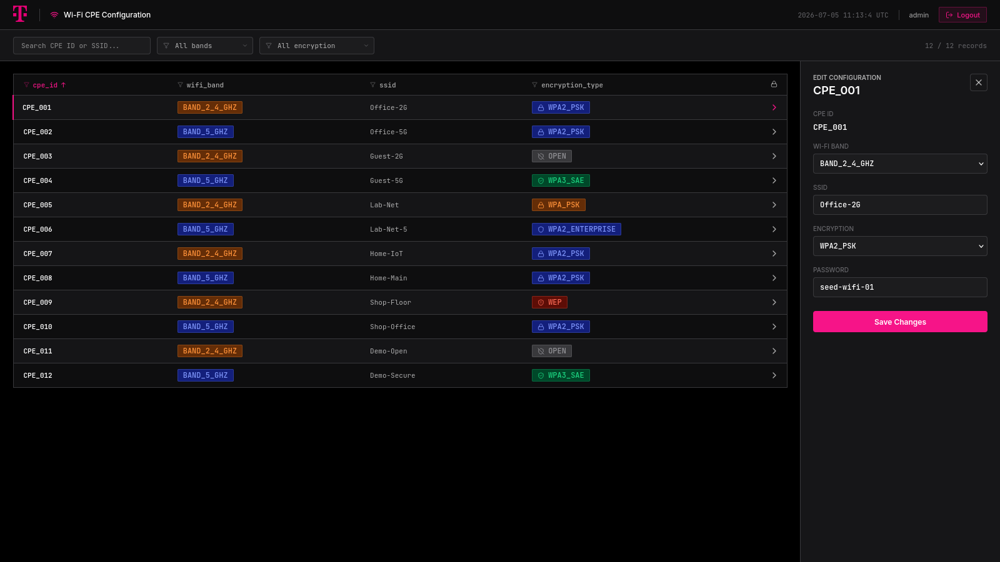

# Wifi Admin

[](https://github.com/meowpow-png/wifi-admin/actions/workflows/ci.yml)
[](https://codecov.io/gh/meowpow-png/wifi-admin)
[](https://spring.io/projects/spring-boot)
[](https://www.postgresql.org/)
[](https://react.dev/)
[](https://www.docker.com/)

<p align="center">
  
  
</p>

## What is This?

Wifi Admin is an assignment project developed for Hrvatski Telekom that enables administrators to manage Wi-Fi configuration on CPE devices

The project began as a backend assignment to build a REST wrapper around an existing SOAP platform for managing Wi-Fi configuration on CPE devices. It has since grown into a full-stack application with a React frontend, local persistence, authentication, synchronization, and observability.

The deployment is production-style rather than production itself. It demonstrates the application running as a complete stack—including the web UI, backend API, database, SOAP mock, and supporting services—without pretending to be a cloud-native masterpiece that accidentally landed on Kubernetes.

## How it Works?

The React frontend talks to the backend through a REST API, giving administrators a straightforward way to view and update Wi-Fi configuration for CPE devices without having to think about SOAP. That's the backend's problem.

The backend takes care of authentication, validation, REST-to-SOAP translation, persistence, and error handling, while treating the SOAP platform as the source of truth.

PostgreSQL keeps a local replica of Wi-Fi configurations to avoid bothering the SOAP platform for every read. If data is missing locally, the backend falls back to SOAP. Updates always go to the SOAP platform first, then the confirmed configuration is persisted locally.

The backend also supports scheduled synchronization and exposes an SSE endpoint for configuration changes. The frontend does not currently consume those events, but the endpoint is available for future use.

```text
┌──────────────┐
│ React Web UI │
└──────┬───────┘
       │ HTTP / JSON
       ▼
┌──────────────┐
│ Backend API  │
└───┬──────┬───┘
    │      │
    │      │ SOAP
    │      ▼
    │  ┌───────────────┐
    │  │ SOAP Platform │
    │  └───────────────┘
    │
    ▼
┌──────────────┐
│ PostgreSQL   │
└──────────────┘
```

## Quick Start

### Requirements

- Docker with Docker Compose
- `just` command runner, optional but handy

### How to Run

Set up the backend:

```shell
just setup
```

Build application images:

```shell
just build
```

Start the production-style local stack:

```shell
just deploy
```

Open the web UI:

```text
http://localhost
```

Grafana is available at:

```text
http://localhost:3000
```

Default credentials are `admin` / `admin` for both the web UI and Grafana. Ultra secure by default, naturally.

No `just`? Same idea, a little more typing:

```shell
cd backend && ./gradlew setup && cd ..
docker compose -f backend/compose-dev.yml build
docker compose -f frontend/compose-dev.yml build
docker compose -f compose.yml up -d
```

That setup command copies `backend/.env.example` to `backend/.env` if needed.

To stop everything:

```shell
just compose down -v
```

Without `just`:

```shell
docker compose -f compose.yml down -v
```

## Development

### Setup

Run the same setup used by Quick Start:

```shell
just setup
```

Without `just`:

```shell
cd backend && ./gradlew setup && cd ..
```

Most day-to-day commands are wrapped by the root `Justfile`, with backend and frontend recipes exposed as `backend::...` and `frontend::...`.

### Commands

List available recipes:

```shell
just
```

Build everything:

```shell
just build
```

Clean everything:

```shell
just clean
```

Run the development Docker stack:

```shell
just compose-dev up -d
```

Run the production-style local stack:

```shell
just deploy
```

Note that Loki can take a little while to become healthy. The app may be ready before the logging stack finishes its morning coffee.

Useful backend API helpers:

```shell
just backend::login
just backend::wifi-get CPE_001
just backend::wifi-update CPE_001 "Office WiFi"
```

Frontend commands go through npm:

```shell
just frontend::npm run dev
just frontend::npm run lint
just frontend::npm run build
```

### Testing

Backend tests are split by scope:

```shell
just backend::gradle test
just backend::gradle integrationTest
just backend::gradle architectureTest
```

Coverage report:

```shell
just backend::gradle coverage
```

The frontend does not have a test suite; use lint and build checks there.

## Further Reading

### Project Documentation

- [Assignment](docs/ASSIGNMENT.md)
- [Roadmap](docs/ROADMAP.md)
- [Deployment](docs/DEPLOYMENT.md)
- [Backend README](backend/README.md)
- [Backend Architecture](backend/docs/ARCHITECTURE.md)
- [Backend Implementation](backend/docs/IMPLEMENTATION.md)
- [Backend Security](backend/docs/SECURITY.md)
- [Backend Testing](backend/docs/TESTING.md)
- [Frontend Architecture](frontend/docs/ARCHITECTURE.md)

### Design Records

- [ADR-001: Local Database](backend/docs/adr/001-adr-local-database.md)
- [ADR-002: Synchronize Platform Data](backend/docs/adr/002-adr-synchronize-platform-data.md)
- [ADR-003: Retries for Transient Failures](backend/docs/adr/003-adr-retries-for-transient-failures.md)
- [ADR-004: Token-Based Authentication](backend/docs/adr/004-adr-token-based-authentication.md)
- [ADR-005: Contract-First Integration Strategy](backend/docs/adr/005-adr-contract-first-integration-strategy.md)
- [ADR-006: Platform Interactions as Application Events](backend/docs/adr/006-platform-interactions-as-application-events.md)

### Notes

- [SOAP Integration with Mockoon](backend/docs/notes/001-note-soap-integration-with-mockoon.md)
- [SOAP Response Normalization](backend/docs/notes/002-note-soap-response-normalization.md)
- [Password Validation Requirement](backend/docs/notes/003-note-password-validation-requirement.md)
- [SOAP Fault Handling](backend/docs/notes/004-note-soap-fault-handling.md)
- [Configurable CPE Synchronization](backend/docs/notes/005-note-configurable-cpe-synchronization.md)
