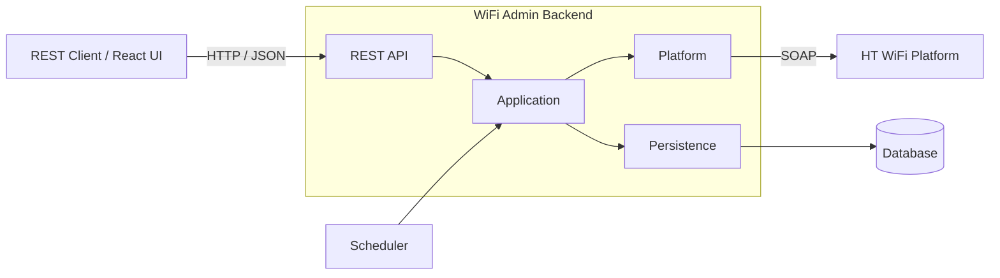
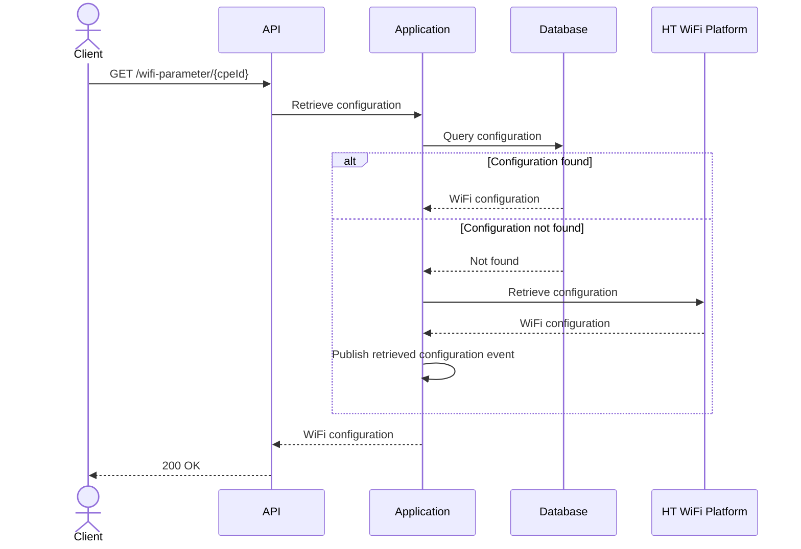
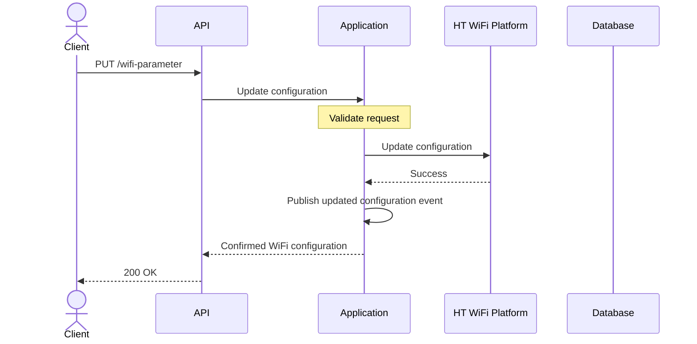
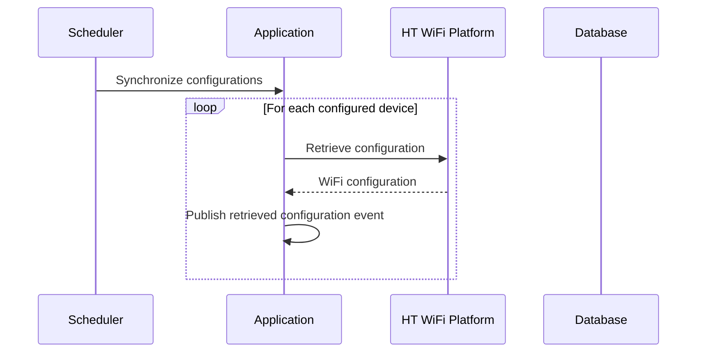

# Architecture

This document describes the application's architecture and high-level design. Implementation details, technologies, and development conventions are documented in [IMPLEMENTATION.md](IMPLEMENTATION.md).

## Vision

The goal of this architecture is to build a production-quality integration service rather than a minimal assignment solution. The design emphasizes clear module boundaries, maintainability, extensibility, and operational readiness while remaining simple and easy to understand.

## Architectural Principles

The architecture is guided by the following principles:

- **Separation of Concerns** – Each module has a single, well-defined responsibility
- **Business-Centric Design** – Business logic remains independent of REST, SOAP, persistence, and framework-specific concerns
- **Encapsulated Integrations** – External systems are isolated behind dedicated integration boundaries
- **Observability by Default** – Logging, tracing, health checks, and operational endpoints are built into the application
- **Production Readiness** – Validation, configuration, testing, and error handling are first-class concerns

## System Context

The application acts as a bridge between REST clients and the external WiFi platform. It exposes a REST API, persists WiFi configurations locally, and synchronizes data with the external platform.



## Logical Architecture

The application follows **Domain-Driven Design** within a **Ports and Adapters Hexagonal Architecture**. The domain is centered around a single bounded context, **WiFi Administration**, and the application is organized into four logical modules, each with a clear responsibility.

### Modules

- **Domain** contains the business model and business rules. It is independent of frameworks and infrastructure technologies
- **Application** contains use cases and application ports. It orchestrates business operations without exposing transport-specific concerns
- **Infrastructure** contains technical implementations such as REST, SOAP, persistence, and configuration
- **Common** contains shared utilities and cross-cutting abstractions

### Dependency Rules

- Domain module must not depend on any other application module
- Application module may depend only on the domain and common modules
- Infrastructure module may depend on the application, domain, and common modules
- Common module must not depend on any other application module

```text
Application ─────────► Domain
      │
      └──────────────► Common

Infrastructure ──────► Application
Infrastructure ──────► Domain
Infrastructure ──────► Common

Domain ──────────────► (nothing)

Common ──────────────► (nothing)
```

- Inbound ports define application capabilities and are implemented by services.
- Outbound ports define external capabilities and are implemented by infrastructure.
  
```text
┌──────────────────────────────┐
│       Infrastructure         │
│                              │
│      Inbound Adapters        │
└──────────────┬───────────────┘
               │
               ▼
┌──────────────────────────────┐
│        Application           │
│                              │
│       Inbound Ports          │
│              │               │
│              ▼               │
│    Application Services      │
│         ┌────┴────┐          │
│         │         │          │
│         ▼         ▼          │
│   Domain Model  Outbound     │
│                  Ports       │
└────────────────────┼─────────┘
                     │
                 implements
                     ▲
┌────────────────────┴─────────┐
│        Infrastructure        │
│                              │
│      Outbound Adapters       │
└──────────────────────────────┘
```

## Request Processing

### Read Flow

Retrieves the requested WiFi configuration from the database. If the configuration is not available, it is retrieved from the external platform, stored in the database, and returned to the client.



### Update Flow

Validates the request, propagates the change to the external platform, and publishes the updated configuration for asynchronous persistence upon successful completion.



### Synchronization Flow

Synchronizes WiFi configurations from the external platform into the database at regular intervals.



## Platform Integration

The external WiFi platform is isolated behind an integration boundary, forming an anti-corruption layer that prevents platform-specific concerns from leaking into the business domain.

The following integration principles are applied:

- All platform communication is performed through the integration boundary
- The published service contract defines the integration boundary
- Platform-specific models are mapped to the domain model before crossing module boundaries
- Platform-specific failures are translated into domain-specific exceptions

Related architectural decisions:

- [ADR-003: Use Retries for Transient Failures](adr/003-adr-retries-for-transient-failures.md)
- [ADR-005: Adopt a Contract-First Integration Strategy](adr/005-adr-contract-first-integration-strategy.md)

## Cross-Cutting Concerns

### Validation

Request validation is performed at the API boundary. Domain invariants and business rules that cannot be validated at the API boundary are enforced within the domain.

### Exception Handling

Expected failures are represented by explicit, domain-specific exceptions. Infrastructure failures are translated before reaching the API layer to ensure consistent REST error responses.

### Logging

Application requests, platform interactions, and unexpected failures are logged using structured logging while excluding sensitive information.

### Correlation IDs

A unique correlation ID is assigned to every request and propagated throughout request processing to enable end-to-end tracing.

### Observability

The application exposes health information and operational endpoints. Health checks verify the availability of critical dependencies.

### Configuration

Application configuration is externalized to support environment-specific deployments.

### Security

The application protects sensitive information throughout its lifecycle by minimizing exposure, encrypting recoverable secrets, hashing authentication credentials, and externalizing cryptographic material from the application.

The security architecture addresses the following threats:

- Unauthorized access to application endpoints
- Disclosure of administrator credentials through database access or backups
- Disclosure of WiFi passwords through application logs or error responses
- Disclosure of WiFi passwords through database access or backups
- Disclosure of cryptographic keys through source control

The following security principles are applied:

- Authentication is required before protected operations can be performed  
- Recoverable secrets and authentication credentials are protected using appropriate cryptographic techniques  
- Sensitive information is not exposed through application interfaces or operational diagnostics  
- Cryptographic material is managed independently of the application binary

Implementation details are documented in [SECURITY.md](SECURITY.md).

Related architectural decisions:

- [ADR-004: Use Token-Based Authentication](adr/004-adr-token-based-authentication.md)

## Persistence Strategy

WiFi configurations are stored in a database to reduce platform dependency, improve response times, and provide durable persistence across application restarts. The database serves read requests, while the external platform remains the authoritative source of truth.

The following persistence policies are applied:

- WiFi configurations are read from the database by default
- Missing configurations are retrieved from the platform and stored in the database
- Configuration changes are published for persistence after successful platform updates
- Successful platform interactions publish events that drive persistence and other follow-up processing
- Database failures during retrieval fall back to the external platform when possible

Related architectural decisions:

- [ADR-001: Use a Local Database](adr/001-adr-local-database.md)
- [ADR-002: Synchronize Platform Data](adr/002-adr-synchronize-platform-data.md)
- [ADR-006: Model Platform Interactions as Application Events](adr/006-platform-interactions-as-application-events.md)

## Synchronization Strategy

Periodic synchronization keeps the database aligned with the external WiFi platform. During synchronization, the platform is treated as the authoritative source and local records are updated accordingly.

The following synchronization policies are applied:

- Synchronization runs on a configurable schedule
- The set of synchronized CPEs is configurable
- Each CPE is synchronized independently
- Synchronization failures abort the current job
- Local data is removed only after a successful synchronization

Note that synchronization strategy maintains only the current platform state. Historical configuration snapshots are outside the scope of this project.

Related architectural decisions:

- [ADR-002: Synchronize Platform Data](adr/002-adr-synchronize-platform-data.md)

## Testing Strategy

### Unit Tests

Unit tests verify individual components in isolation. They focus on business logic, validation, mapping, and error handling without requiring external infrastructure.

### Integration Tests

Integration tests verify interactions between application components and external dependencies. They ensure the application behaves correctly in a production-like environment.

### Architecture Tests

Architecture tests enforce the project's structural rules. They verify module boundaries, dependency rules, and architectural constraints to prevent architectural drift as the codebase evolves.
