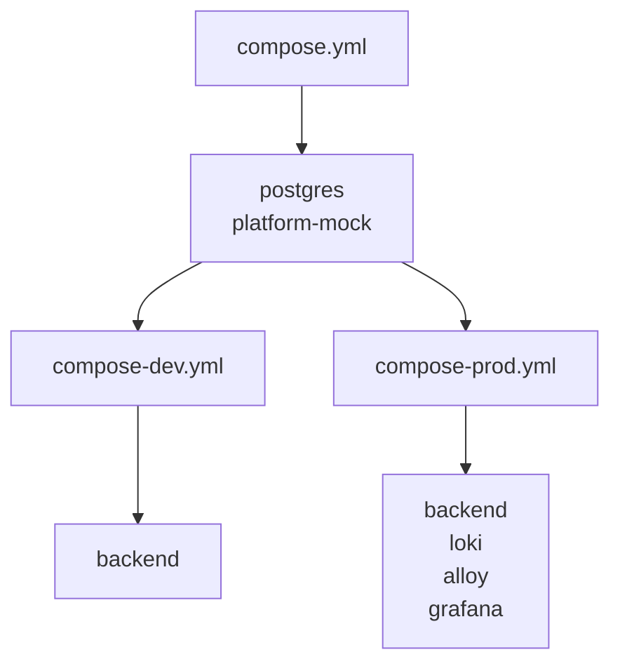
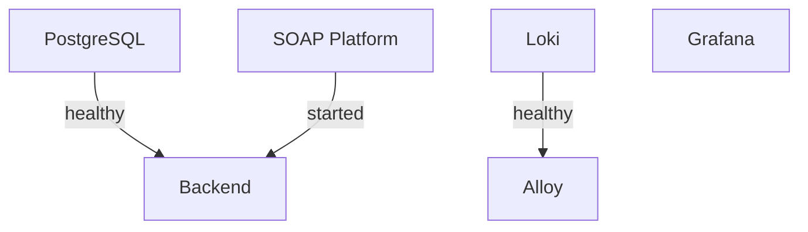

# Deployment

This document describes the project's deployment setup using Docker Compose.

The application provides separate development and production deployments that share the same backend image while differing in runtime configuration and supporting services. It also explains the design decisions and trade-offs behind the deployment configuration.

## Architecture

The deployment is organized into a shared Docker Compose configuration with separate development and production overlays, as shown below. This structure avoids duplicating shared infrastructure while allowing each environment to define only its additional services and configuration.

Both environments deploy the same Docker image, with runtime behavior determined by the active Spring profile and injected environment variables. The production deployment additionally includes the observability stack.

## Docker Image

The backend is packaged as a multi-stage Docker image to minimize the size of the final runtime image. The first stage uses the Eclipse Temurin JDK to analyze the application and build a custom Java runtime, while the second stage contains only the generated runtime and the application JAR.

The custom runtime is built using `jdeps` and `jlink` to include only the Java modules required by the application. This reduces the size of the final image, decreases the attack surface by excluding unnecessary runtime components, and avoids shipping a full JDK in production.

## Configuration

The backend image is configured entirely through environment variables, allowing the same image to be deployed in different environments without modification. Runtime settings such as database connectivity, cryptographic secrets, and the active Spring profile are supplied by the corresponding Docker Compose configuration.

The only exception is the SOAP platform endpoint, which is intentionally configured to use the provided mock platform for the assignment. In a production deployment, this endpoint should be externalized and configured to point to the actual SOAP platform.

## Observability

### Logging

The production deployment includes an observability stack consisting of Grafana, Loki, and Alloy. Alloy collects structured logs from Docker containers, enriches them with additional metadata, and forwards them to Loki for centralized storage.

Loki and Alloy are intentionally accessible only within the Docker network, as they are consumed exclusively by other containers. Grafana is exposed to the host to provide access to dashboards and log exploration during local deployment.

### Dashboards

The project includes two provisioned Grafana dashboards that provide complementary views of the deployed application and its observability infrastructure.

The **Docker** dashboard provides an infrastructure-level overview of the deployment. It contains a dedicated panel for each Docker Compose service, allowing container logs to be monitored from a single dashboard. This view is primarily intended to verify that all services are operating correctly and to assist in diagnosing deployment and infrastructure issues.

The **Backend** dashboard provides multiple views of application's structured logs:

- **Server Logs** present the formatted application logs emitted by Spring Boot
- **Container Logs** display the raw structured JSON log records collected from the backend container, exposing all emitted log fields for inspection
- **Application Logs** provide a simplified operational view focused on application messages while reducing implementation-specific details
- **Event Logs** display high-level application events together with shortened trace identifiers, allowing related log entries to be correlated and execution flows to be followed across synchronous and asynchronous processing

### Provisioning

Grafana is automatically provisioned with the required data sources and dashboards, allowing the logging stack to be used immediately after deployment.

The `just/scripts/grafana-export.sh` script exports all dashboards through the Grafana HTTP API and stores them in `docker/grafana/dashboards`. Dashboards are exported in the classic JSON format and named according to their Grafana dashboard UID, allowing them to be version-controlled and automatically provisioned in subsequent deployments.

## Health Checks

Health checks are configured to verify service availability and coordinate container startup through Docker Compose.

The following services define health checks:

- **PostgreSQL** ensures database is accepting connections before other services start
- **Backend** uses Spring Boot Actuator endpoint to verify platform availability
- **Loki** verifies that the log storage service is ready before Alloy begins forwarding logs

Note that Grafana intentionally does not define a health check. The selected distroless image does not include the tooling required to implement one, and no other service depends on it during startup.

## Notes

- The project intentionally uses an untagged Docker image because deployments are performed directly from the local source tree and no image registry or release process exists. Future production deployments should instead use immutable versioned image tags produced by a CI/CD pipeline
- The backend (`8081`) and Actuator (`8082`) ports are intentionally exposed to the host to simplify local development and demonstration
- Loki and Alloy are intentionally accessible only within the Docker network
- A production deployment should place the application behind a reverse proxy and restrict access to management endpoints through network-level controls
