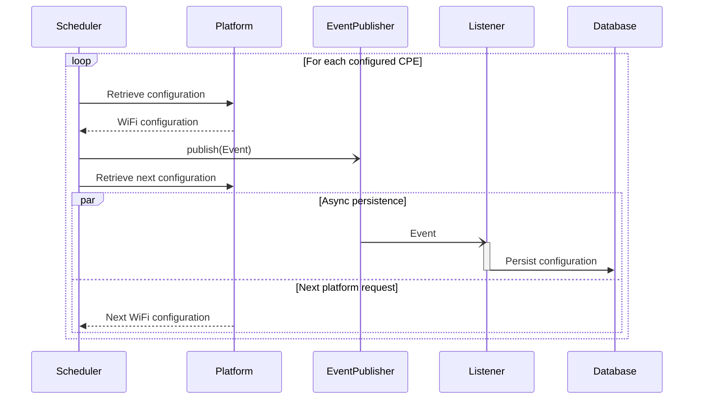
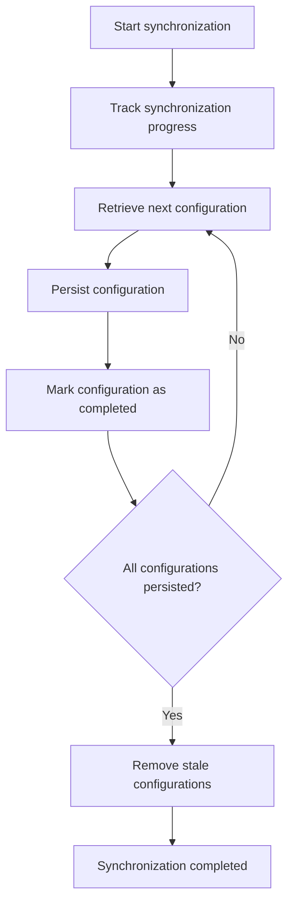
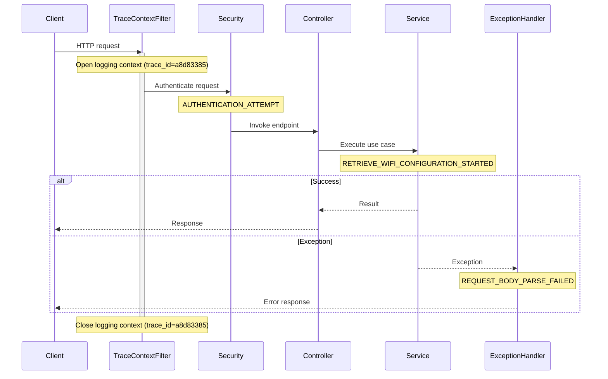
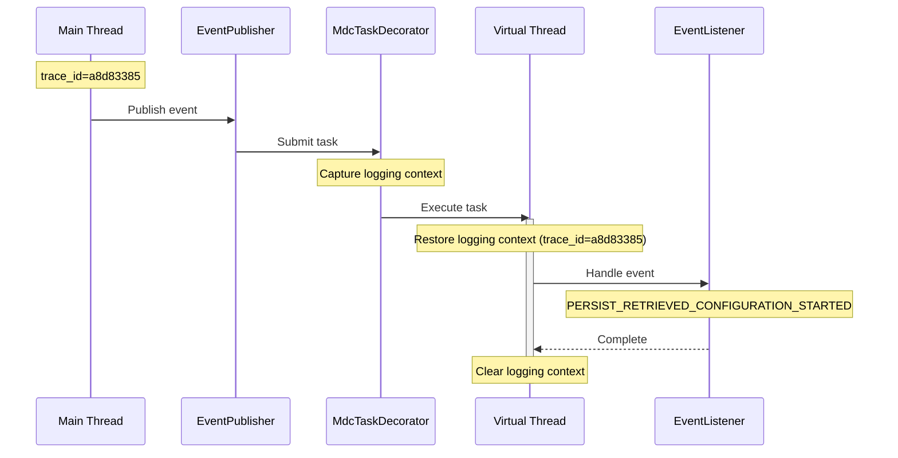

# Implementation

This document describes how the architecture defined in [ARCHITECTURE.md](ARCHITECTURE.md) is implemented. It documents the project's implementation decisions, technologies, and development conventions.

## Technology Stack

| Area          | Technology                                          |
|---------------|-----------------------------------------------------|
| Runtime       | Java 21, Spring Boot                                |
| API           | Spring Web                                          |
| API Contract  | OpenAPI                                             |
| Integration   | Apache CXF                                          |
| Data          | PostgreSQL, Spring Data JPA, Flyway                 |
| Validation    | Jakarta Bean Validation                             |
| Security      | Spring Security                                     |
| Logging       | SLF4J, Logback                                      |
| Observability | Spring Boot Actuator                                |
| Testing       | JUnit 5, Mockito, Testcontainers, ArchUnit          |
| Deployment    | Docker, Docker Compose                              |

## Project Structure

The project is organized into top-level packages that reflect the logical architecture. Each package corresponds to a single architectural module and groups related implementation concerns.

### Modules

```text
src/main/java
└── hr
    └── ht
        └── rnd
            └── wifiadmin
                ├── application
                ├── common
                ├── domain
                └── infra
```

| Package       | Responsibility                              |
|---------------|---------------------------------------------|
| `application` | Use cases, application services, and ports  |
| `domain`      | Domain model and business rules             |
| `infra`       | REST, SOAP, persistence, and configuration  |
| `common`      | Shared utilities and cross-cutting concerns |

### Application Structure

The application module follows the **Ports and Adapters** architecture.

```text
application
├── inbound
├── outbound
└── service
```

| Package    | Responsibility                                                  |
|------------|-----------------------------------------------------------------|
| `inbound`  | Defines the application's public capabilities                   |
| `outbound` | Defines the application's required external capabilities        |
| `service`  | Implements capabilities and orchestrates business operations    |

## Platform Integration

The application integrates with the external WiFi platform using Apache CXF. SOAP client classes are generated directly from the published WSDL and confined to the integration layer, where they are translated into the domain model through dedicated mappers.

The SOAP client is configured with connection and read timeouts. Additional client configuration ensures compatibility with the target platform by preferring HTTP/1.1 transport and explicit namespace prefixes. Transient communication failures are handled with a configurable retry policy and exponential backoff strategy.

SOAP faults and transport exceptions are translated into domain-specific exceptions before leaving the integration layer.

## Resilience

Communication with the external SOAP platform is hardened against transient failures through configurable resilience mechanisms. These mechanisms improve availability during temporary network interruptions and platform unavailability while preventing requests from blocking indefinitely.

The resilience implementation provides the following capabilities:

- Configurable connection and read timeouts for SOAP communication
- Configurable retry policy with exponential backoff for transient transport failures
- Automatic translation of SOAP client transport failures into domain-specific platform exceptions
- Structured logging of retry attempts and exhausted retry policies for operational monitoring

## Persistence

WiFi configurations are persisted in PostgreSQL using Spring Data JPA. Database schema changes are managed through Flyway versioned migrations.

The application maintains a local replica of the WiFi configurations stored in the external platform. Repository operations are encapsulated behind application ports, allowing the persistence implementation to remain isolated from the application layer.

Retrieved configurations are served from the local database when available and fall back to the external platform on cache misses or repository failures. Successful platform interactions publish application events that are handled asynchronously to persist retrieved or updated configurations to the local database, update the in-memory WiFi configuration projection used for collection reads, and notify subscribers about collection changes. This keeps orchestration services focused on communicating with the external platform while allowing persistence and other follow-up processing to execute independently without delaying client responses.

Authenticated clients can subscribe to `/admin/events` for a Server-Sent Events stream. The stream emits a `configurations-changed` event after retrieved or updated WiFi configurations have been persisted and projected, allowing clients to refresh collection data without polling.

## Synchronization

### Execution

Synchronization is implemented using Spring Scheduling with a configurable execution schedule and set of synchronized devices. Platform configurations are retrieved sequentially and published as application events. Persistence and other follow-up processing execute asynchronously, allowing the scheduler to continue retrieving the next configuration without waiting for local processing to complete.

This event-driven approach provides a natural extension point for additional future processing, such as metrics collection, audit logging, or notifications.



Platform requests are intentionally performed one at a time to keep synchronization predictable and avoid making assumptions about the external platform's ability to handle concurrent requests. If higher synchronization throughput is ever required, concurrent retrieval can be introduced later without changing the overall workflow.

### Consistency

To prevent stale configurations from being removed after a partially completed synchronization, synchronized configurations are tracked until all persistence operations complete successfully. Only then are configurations missing from the current synchronization removed from the local database.



### Observability

## Configuration

Application configuration is externalized to support environment-specific deployments. Common settings are defined in the default configuration, while environment-specific overrides are organized into separate configuration files:

- `application.properties` — common configuration
- `application-dev.properties` — local development
- `application-test.properties` — automated testing

Sensitive configuration is supplied through environment variables rather than being stored in source control. Examples include:

- Database credentials
- JWT signing secrets
- External platform endpoints

Containerized deployments provide environment-specific configuration through Docker Compose, including:

- Database connection settings
- External platform endpoints
- JWT signing secrets
- Active Spring profile

## Exception Handling

Platform and application exceptions are translated into REST error responses by a global exception handler.

### Validation Failures

The following validation failures result in a `400 Bad Request` response:

- **Request parsing:** malformed JSON, invalid enum values, type mismatches
- **Bean validation:** missing required fields, blank values, constraint violations
- **Business validation:** missing password for encrypted Wi-Fi, other invalid configuration combinations

### Resource Not Found

An unknown `cpeId` results in a `404 Not Found` response.
  
### Platform Integration Failures

The following platform integration failures result in a `502 Bad Gateway` response:

- **SOAP faults:** platform-reported errors
- **Network timeouts:** request timeouts while communicating with the SOAP platform
- **Other communication failures:** transport-level communication errors
  
### Unexpected Exceptions

Any unhandled exception results in a `500 Internal Server Error` response.
  
### Error Response Model

All error responses use the common `ErrorBody` model defined by the OpenAPI specification. This model is also used for `500` error responses.

```json
{
  "message": "string",
  "code": "string"
}
```

| Field     | Description                              |
|-----------|------------------------------------------|
| `message` | Human-readable description of the error. |
| `code`    | Application-specific error identifier.   |

## Security

The application secures administrator access through stateless authentication and protects sensitive data using appropriate cryptographic techniques. Security measures include:

- JWT-based authentication and authorization
- BCrypt hashing of administrator passwords
- AES encryption of persisted WiFi passwords
- Externalized cryptographic keys and security configuration
- Centralized authentication and exception handling
- Exclusion of sensitive information from logs and error responses

See [SECURITY.md](SECURITY.md) for more implementation details.

## Observability

### Logging

The application uses SLF4J with Logback to produce **structured application logs** suitable for centralized log aggregation and analysis.

Operational events are logged at the following severity levels:

- **TRACE** – Low-level protocol details, such as SOAP request and response payloads
- **DEBUG** – Diagnostic information, such as outbound SOAP interactions
- **INFO** – Successful operations, such as retrieving or updating Wi-Fi configurations
- **WARN** – Recoverable issues, such as missing resources
- **ERROR** – Unexpected failures, such as network or platform errors

Sensitive information, including Wi-Fi passwords, user passwords, JWTs, and authorization headers, is never written to the logs. Where appropriate, sensitive values are partially obfuscated for troubleshooting.

### Trace Correlation

Each application execution is assigned a unique trace identifier that is automatically included in structured log entries. Trace identifiers enable all log messages produced during a single execution to be correlated, including those emitted by synchronous and asynchronous processing.

For example, a successful administrator login produces multiple log entries that share the same trace identifier. In Grafana, filtering by the trace identifier reconstructs the complete execution:

```text
2026-07-07 16:13:54.703 DEBUG AUTHENTICATION_ATTEMPT b80b424a
2026-07-07 16:13:54.880 DEBUG AUTHENTICATION_SUCCEEDED b80b424a
```

More complex operations span multiple application components while retaining the same trace identifier. For example, retrieving a Wi-Fi configuration correlates the REST request, platform communication, and asynchronous persistence:

```text
2026-07-07 16:14:44.738 INFO  RETRIEVE_WIFI_CONFIGURATION_STARTED a8d83385
2026-07-07 16:14:44.739 DEBUG WIFI_CONFIGURATION_NOT_FOUND a8d83385
2026-07-07 16:14:44.745 TRACE OUTBOUND_SOAP_REQUEST a8d83385
2026-07-07 16:14:44.783 TRACE INBOUND_SOAP_RESPONSE a8d83385
2026-07-07 16:14:44.785 DEBUG PERSIST_RETRIEVED_CONFIGURATION_STARTED a8d83385
2026-07-07 16:14:44.791 DEBUG PERSIST_RETRIEVED_CONFIGURATION_COMPLETED a8d83385
```

Structured log fields remain available for filtering and inspection. For example, the correlated log entry below includes the associated CPE identifier:

```json
{
  "trace_id": "a8d83385-fe0f-4a77-9c0b-10da98c31c15",
  "event": "PERSIST_RETRIEVED_CONFIGURATION_STARTED",
  "cpe_id": "CPE_002"
}
```

Logging contexts are established only at application entry points, such as HTTP requests, scheduled tasks, and application bootstrap. Downstream components participate in the active logging context without requiring trace identifiers to be passed through method parameters.



Asynchronous processing propagates the logging context to worker threads, ensuring that event listeners and other asynchronous operations continue the originating trace rather than starting a new one.



### Health

The application exposes a health endpoint that reports the health of its infrastructure dependencies. Built-in health indicators monitor application availability, the PostgreSQL database, and available disk space, while a custom health indicator verifies connectivity with the external SOAP platform. The overall health status is derived by aggregating the individual health indicators.

The backend container uses this endpoint as its Docker health check, allowing container orchestration to detect when the application is ready to accept requests and to monitor its runtime health.

## Management

### Interface

Application management is implemented using Spring Boot Actuator, which hosts the management interface on port `8082`, separate from the public REST API.

During development, the management interface is exposed to simplify administration and testing. In production, it is intended to remain internal and be protected by infrastructure such as a reverse proxy or firewall, preventing management endpoints from being exposed to public networks.

### Commands

The management interface exposes the following Actuator endpoints:

- `health` reports the health of the application and its infrastructure dependencies
- `shutdown` gracefully terminates the application
- `sync` triggers an on-demand synchronization with the external SOAP platform
- `logging` changes the application log level at runtime
- `payloadlogging` enables or disables SOAP payload logging for troubleshooting

## Testing

### Unit Tests

Unit tests are implemented using JUnit 5 and Mockito. They execute without a Spring context and verify business logic, validation, mapping, and error handling in isolation.

### Integration Tests

Integration tests execute against production-like infrastructure using Testcontainers. A PostgreSQL container is provisioned automatically for each test run, while the provided SOAP platform mock is used to verify interactions between the REST API, database, and external platform.

### Architecture Tests

Architecture tests are implemented using ArchUnit to verify package structure, dependency rules, and architectural boundaries.
