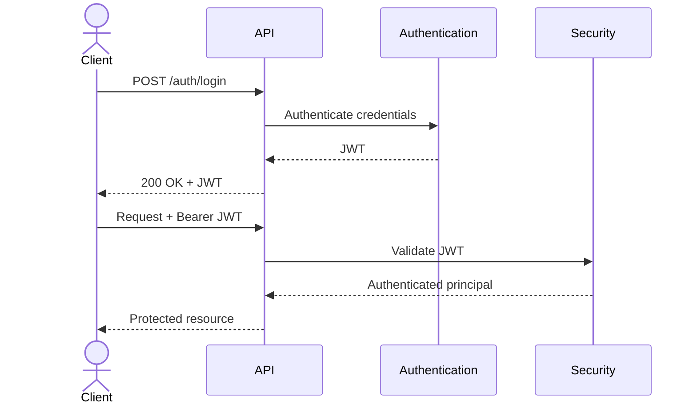
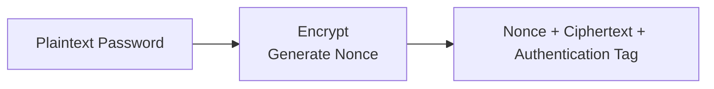
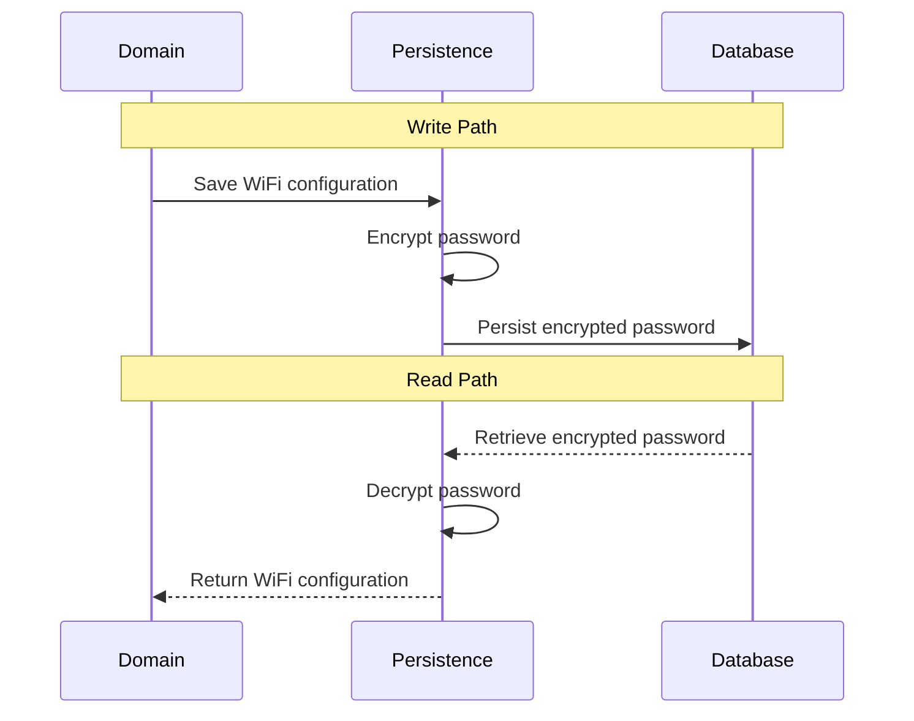

This document describes the implementation of the application's security mechanisms. It covers password modeling, authentication, cryptographic protection, persistence, key management, logging, and validation.

## Password Models

The application distinguishes between administrator account passwords and WiFi passwords because they have different security requirements.

Administrator passwords are used to authenticate administrators and are therefore stored as one-way BCrypt hashes. They cannot be recovered from persistent storage.


WiFi passwords must be retrieved and presented to authenticated administrators. They are represented by a dedicated value object within the domain model and remain in plaintext while the application is executing. Encryption and decryption are performed transparently at the persistence boundary, keeping cryptographic concerns isolated from business logic.


## Authentication

The application uses stateless token-based authentication to protect the REST API. 

Administrator credentials are verified during login, after which authenticated clients receive a signed JWT that is presented with subsequent requests.Authentication is performed and authorization enforced by the infrastructure layer, allowing application services to operate independently of the underlying security framework.

Note that the application does not maintain server-side authentication sessions. Instead, each request is authenticated independently using the JWT presented by the client.

### Diagram



### Cross-Origin Requests

Cross-origin requests are controlled using Spring Security's CORS support. Allowed origins are externalized through application configuration, allowing browser-based clients to access the REST API only from trusted origins while rejecting requests from unauthorized origins.

### Login Flow

Administrator credentials are submitted to the authentication endpoint and verified using Spring Security. Upon successful authentication, the application issues a signed JWT containing the administrator identity. The token is returned to the client and is used to authenticate subsequent requests.

### Access Tokens

JWTs are signed using a server-side signing key and contain the authenticated administrator's identity together with standard expiration metadata. Protected endpoints require clients to present the token in the `Authorization` header using the Bearer authentication scheme.

The application validates the token signature and expiration before establishing the authenticated administrator for the duration of the request. Invalid or expired tokens are rejected and access to protected endpoints is denied.

## Encryption

WiFi passwords are encrypted before being persisted to the database and decrypted when retrieved. Each encryption operation generates a new random nonce and produces an authentication tag, ensuring confidentiality and integrity while remaining transparent to the rest of the application.



### Algorithm

WiFi passwords are encrypted using AES-256-GCM with a randomly generated 96-bit nonce and a 128-bit authentication tag. A new nonce is generated using `SecureRandom` for every encryption operation and is never reused with the same encryption key. This provides confidentiality and integrity for persisted passwords.

### Ciphertext Format

Encrypted WiFi passwords are stored as versioned ciphertext in the format `enc:v1:<base64>`. The encoded payload contains the nonce, ciphertext, and authentication tag required for decryption. Versioning allows the encryption format to evolve without requiring database schema changes by allowing the decryptor to support multiple ciphertext versions while new passwords are encrypted using the latest format. Note that the current implementation supports only `enc:v1` ciphertext format.

```text
enc:v1:AbCdEfGhIjKlMnOpQrStUvWxYz...
│   │
│   └── Base64 encoded payload
└────── Ciphertext format version
```

The ciphertext is stored as text rather than binary to produce a self-describing, portable representation that can be safely backed up, migrated, and inspected across different systems. This slightly increases storage size due to Base64 encoding but avoids introducing a binary persistence format for relatively small password values.

### Key Management

Cryptographic keys are externalized through application configuration and supplied via environment variables. They are never stored in source control or persisted alongside protected data.

```properties
wifi-admin.security.aes-key=${AES_KEY}
wifi-admin.security.jwt-secret=${JWT_SECRET}
```

### Persistence

Encryption and decryption of WiFi passwords are performed transparently by the persistence layer. WiFi passwords are encrypted before being written to the database and decrypted when retrieved, ensuring the domain model and application logic operate exclusively on plaintext values.



## Hashing

Administrator passwords are hashed before being persisted to the database and verified when administrator credentials are validated. Unlike encryption, hashing is a one-way operation and the original password cannot be recovered from the stored hash.

The application uses BCrypt with a work factor of **10**. The work factor is intentionally fixed in the implementation rather than externalized through configuration to encode the application's password hashing policy directly in code.

## Logging

Sensitive information is excluded from application logs, exception messages, and diagnostic output. The application applies the following measures:

- Value objects containing sensitive data redact their values from string representations
- Log messages include contextual information without logging sensitive values
- Error responses never expose passwords, cryptographic material, or authentication credentials

For example, logging a WiFi configuration produces a redacted password representation:

```text
WifiConfiguration[cpeId=CPE_001, wifiBand=BAND_2_4_GHZ, ssid=Office-2G, encryptionType=WPA2_PSK, password=********]
```

Authentication failures are logged with request context while omitting credentials:

```text
[2026-07-05 16:48:07.665] [DEBUG] [http-nio-8081-exec-1] [AuthenticationController] Authentication failed for POST /auth/login from 127.0.0.1 (Mozilla/5.0 ...)
```

## Validation

Security-sensitive inputs are validated to detect configuration errors, malformed data, and invalid cryptographic material as early as possible.

- The JWT signing key is validated during application startup
- The AES encryption key is validated during application startup and must be a valid Base64-encoded 256-bit AES key
- JWTs are validated before an authenticated account is established for the request
- Unknown ciphertext versions are rejected without attempting decryption
- Ciphertext format is validated before decryption
- Malformed or tampered ciphertext is rejected without attempting partial decryption
- WiFi passwords are re-encrypted only when their plaintext value changes
