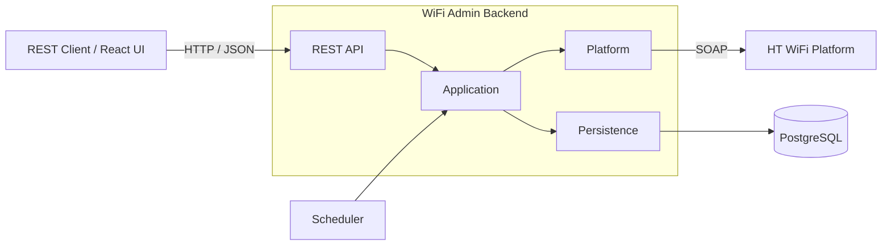
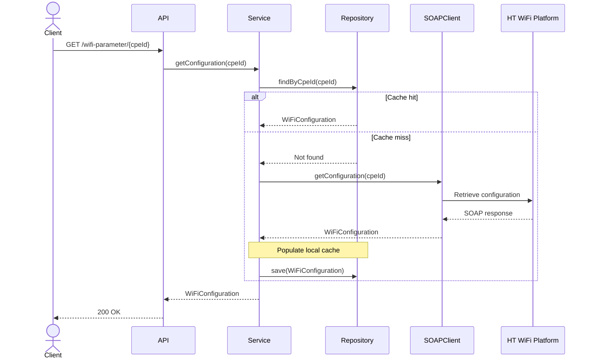
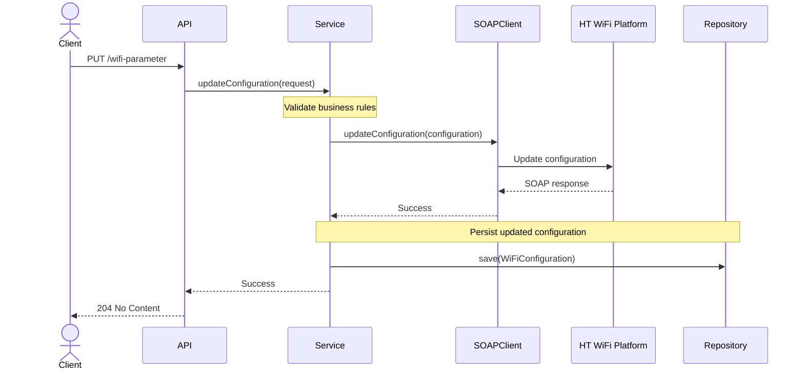
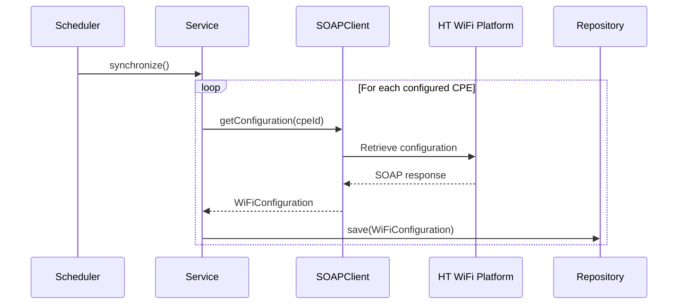

# Architecture

## Vision

The goal of this architecture is to build a production-quality integration service rather than a minimal assignment solution. The design emphasizes clear module boundaries, maintainability, extensibility, and operational readiness while remaining simple and easy to understand.

## Architectural Principles

The architecture is guided by the following principles:

- **Separation of Concerns** – Each module has a single, well-defined responsibility
- **Business-Centric Design** – Business logic remains independent of REST, SOAP, and persistence
- **Encapsulated Integrations** – External systems are isolated behind dedicated integration boundaries
- **Observability by Default** – Logging, metrics, and tracing are built into every operation
- **Production Readiness** – Validation, configuration, testing, and error handling are first-class concerns

## System Context

The application acts as a bridge between REST clients and the external WiFi platform. It exposes a REST API, caches WiFi configurations in PostgreSQL, and synchronizes data with the external SOAP platform.



## Logical Architecture

The application follows a Domain-Driven Design approach centered around a single bounded context, **WiFi Administration**. Business functionality is encapsulated within the bounded context, while shared abstractions and infrastructure concerns are isolated into dedicated top-level modules to maintain clear architectural boundaries.

```text
src/main/java
├── wifi
│   ├── api
│   ├── internal
│   └── model
├── common
└── infra
```

| Package         | Responsibility                      |
|-----------------|-------------------------------------|
| `wifi`          | WiFi Administration bounded context |
| `wifi.api`      | Public API and contracts            |
| `wifi.internal` | Internal implementation             |
| `wifi.model`    | Domain model                        |
| `common`        | Shared abstractions                 |
| `infra`         | Application infrastructure          |

## Dependency Rules

- The `wifi` bounded context may depend only on `common`
- The `common` module must not depend on any other module
- The `infra` module may depend only on `common`
- Infrastructure implementations remain isolated within `infra`
- Shared abstractions and contracts are defined in `common`
- Communication between the bounded context and infrastructure occurs exclusively through abstractions defined in `common`

## Request Processing

### Read Flow

Retrieves the requested WiFi configuration from the local database, falling back to the external platform on a cache miss.



### Update Flow

Validates the request, propagates the change to the external platform, and persists the updated configuration locally upon successful completion.



### Synchronization Flow

Synchronizes WiFi configurations from the external platform into the local database on a scheduled interval.



## Platform Integration

The external WiFi platform is isolated behind a dedicated SOAP client, forming an anti-corruption layer that prevents SOAP-specific concerns from leaking into the business domain.

The following integration principles are applied:

- All platform communication is performed through the SOAP client
- Generated SOAP classes remain confined to the integration layer
- SOAP models are mapped to the domain model before crossing module boundaries
- Platform-specific failures are translated into domain-specific exceptions

## Cross-Cutting Concerns

### Validation

Request validation is performed at the API boundary using Jakarta Bean Validation. Domain invariants and business rules that cannot be expressed declaratively are enforced within the domain model.

### Exception Handling

Expected failures are represented by explicit, domain-specific exceptions. A global `@ControllerAdvice` translates application exceptions into consistent REST error responses, while SOAP faults and infrastructure failures are translated before reaching the API layer.

### Logging

Structured logging is implemented using SLF4J with Logback. Incoming requests, platform calls, and unexpected failures are logged while excluding sensitive information such as WiFi passwords.

### Correlation IDs

A unique correlation ID is assigned to every request and propagated using MDC, enabling end-to-end tracing across HTTP requests, platform communication, and synchronization jobs.

### Observability

Spring Boot Actuator and Micrometer provide health checks, operational endpoints, and application metrics. Custom health indicators verify the availability of PostgreSQL and the external SOAP platform.

### Configuration

Application configuration is externalized using `@ConfigurationProperties`. Environment-specific settings are supplied through configuration files or environment variables.

### Security

Spring Security provides authentication and authorization capabilities. Sensitive information, such as WiFi passwords, is excluded from logs and error responses.

## Persistence Strategy

WiFi configurations are stored in PostgreSQL to reduce platform dependency, improve response times, and provide durable persistence across application restarts. The local database serves read requests, while the external platform remains the authoritative source during synchronization.

The following persistence policies are applied:

- WiFi configurations are read from the local database by default    
- Missing configurations are retrieved from the platform and stored locally
- Configuration changes are persisted only after they have been successfully applied on the platform

## Synchronization Strategy

A scheduled synchronization keeps the local database aligned with the external WiFi platform. During synchronization, the platform is treated as the authoritative source and local records are updated accordingly.

The following synchronization policies are applied:

- Synchronization runs on a configurable schedule
- The set of synchronized CPEs is configurable
- Each CPE is synchronized independently
- Synchronization failures are logged without interrupting the overall job

## Testing Strategy

### Unit Tests

Unit tests verify individual classes in isolation using mocked dependencies. They focus on business logic, validation, mapping, and error handling without requiring external infrastructure.

### Integration Tests

Integration tests verify interactions between application components and external infrastructure, including the database and SOAP platform mock. They ensure the application behaves correctly in a production-like environment.

### Architecture Tests

Architecture tests enforce the project's structural rules using ArchUnit. They verify module boundaries, dependency rules, and package visibility to prevent architectural drift as the codebase evolves.
