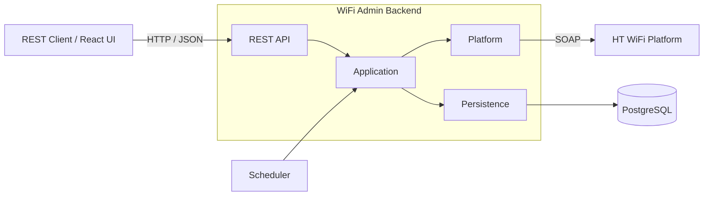
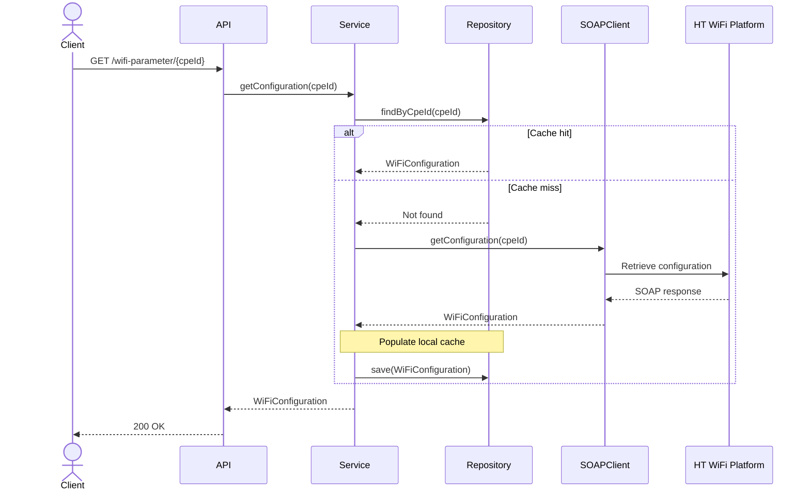
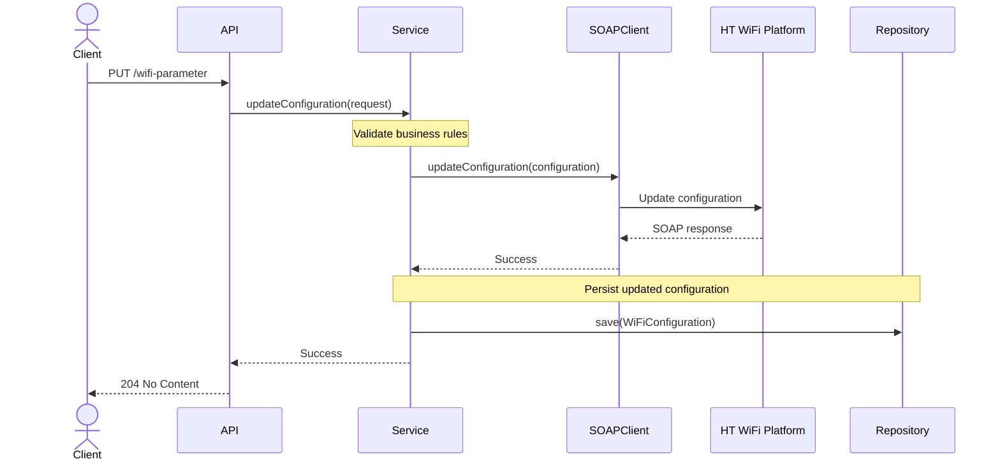
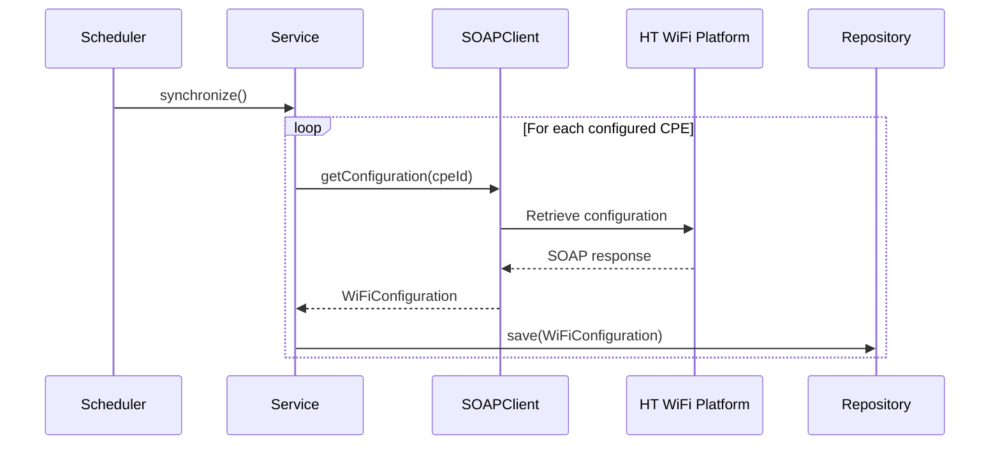

# Architecture

## Vision

The objective of this architecture is to demonstrate how a relatively small integration service can be designed using the same engineering principles expected of larger enterprise systems. Rather than optimizing solely for completing the assignment, the design prioritizes clear boundaries, maintainability, extensibility, and operational readiness, ensuring the solution remains easy to evolve as new requirements are introduced.

## Architectural Principles

The architecture is guided by the following principles:

- **Separation of Concerns** – Each module has a single, well-defined responsibility
- **External Systems Are Isolated** – SOAP communication and generated classes remain encapsulated behind a dedicated integration boundary
- **Business-Centric Design** – Application logic is expressed in terms of the domain, independent of REST or SOAP
- **Observability by Default** – Logging, correlation identifiers, metrics, and consistent error reporting are built into every operation
- **Evolutionary Architecture** – New capabilities, such as persistence, synchronization, and security, should integrate without fundamental structural changes    
- **Production Readiness** – Validation, configuration, testing, and error handling are treated as first-class architectural concerns

## System Context

The application acts as an integration layer between REST clients and the external WiFi platform. It exposes a REST API, persists WiFi configurations in a local PostgreSQL database, and synchronizes changes with the external SOAP platform.



## Logical Architecture

The application is organized around a single bounded context, **WiFi Administration**, following Domain-Driven Design principles. Rather than adopting a traditional layered package structure, the bounded context encapsulates all business functionality while exposing a minimal public API and hiding implementation details behind explicit module boundaries.

Cross-cutting abstractions and technical concerns are separated into dedicated top-level modules to prevent infrastructure concerns from leaking into the business domain.

```text
src/main/java
├── wifi
│   ├── api
│   ├── internal
│   └── model
├── common
└── infra
```

| Package         | Responsibility                      |
|-----------------|-------------------------------------|
| `wifi`          | WiFi Administration bounded context |
| `wifi.api`      | Public API and contracts            |
| `wifi.internal` | Internal implementation             |
| `wifi.model`    | Domain model                        |
| `common`        | Shared abstractions                 |
| `infra`         | Application infrastructure          |

## Dependency Rules

The architecture enforces the following dependency rules to preserve clear module boundaries and prevent unnecessary coupling.

The following rules apply:

- The `wifi` bounded context may depend only on `common`
- The `common` module must not depend on any other module
- The `infra` module may depend only on `common`
- Infrastructure implementations remain isolated within `infra`
- Shared abstractions and contracts are defined in `common`
- Communication between the bounded context and infrastructure occurs exclusively through abstractions defined in `common`

## Request Processing

### Read Flow

Retrieves the requested WiFi configuration from the local database, falling back to the external platform on a cache miss.



### Update Flow

Validates the request, propagates the change to the external platform, and persists the updated configuration locally upon successful completion.



### Synchronization Flow

Synchronizes WiFi configurations from the external platform into the local database on a scheduled interval.



## Platform Integration

The external WiFi platform is isolated behind a dedicated SOAP client, forming an anti-corruption layer between the domain and the platform. This ensures that SOAP-specific concerns, generated classes, and platform contracts remain encapsulated and do not leak into the business domain.

The following integration principles are applied:

- All communication with the external platform is performed exclusively through the SOAP client
- Generated SOAP classes remain confined to the integration layer
- SOAP requests and responses are mapped to the domain model before crossing module boundaries
- Platform-specific failures are translated into domain-specific exceptions

## Cross-Cutting Concerns

### Validation

Request validation is performed at the API boundary using Jakarta Bean Validation to ensure only valid requests enter the application. Domain invariants and business rules that cannot be expressed through declarative constraints are enforced within the domain layer.

### Exception Handling

Expected failure scenarios are represented by explicit, domain-specific exceptions rather than generic runtime exceptions. A global `@ControllerAdvice` translates application exceptions into consistent REST error responses, while infrastructure-specific failures, such as SOAP faults and timeouts, are mapped to meaningful domain exceptions before reaching the API layer.

### Logging

Structured logging is implemented using SLF4J with Logback to provide consistent, searchable log output. Incoming requests, outgoing platform calls, and unexpected failures are logged at appropriate levels while avoiding sensitive information such as WiFi passwords.

### Correlation IDs

A unique correlation ID is assigned to every incoming request and propagated throughout the application using the logging context (MDC). This enables end-to-end tracing across HTTP requests, platform communication, and scheduled synchronization jobs.

### Observability

Spring Boot Actuator provides health checks and operational endpoints for monitoring the application's runtime state. Micrometer is used to expose application metrics, including HTTP requests, platform calls, synchronization jobs, and database operations. Custom health indicators verify the availability of external dependencies, including the SOAP platform and PostgreSQL database.

### Configuration

Application configuration is externalized using Spring Boot's `@ConfigurationProperties`, providing type-safe access to configurable settings. Environment-specific values, such as platform endpoints, timeouts, scheduler settings, and logging levels, are supplied through configuration files or environment variables.

### Security

The application is designed to support Spring Security for authentication and authorization. Sensitive configuration is externalized, request validation is enforced at the API boundary, and confidential information, such as WiFi passwords, is excluded from logs and error responses.

## Persistence Strategy

WiFi configurations are persisted in a PostgreSQL database to reduce platform dependency and improve response times. Unlike in-memory storage, PostgreSQL provides durable persistence, allowing synchronized data to survive application restarts and better reflect a production deployment. The local database acts as the primary data source for read operations, while the external platform remains the authoritative source for synchronization.

The following persistence policies are applied:

- WiFi configurations are read from the local database by default
- If a configuration is not available locally, it is retrieved from the platform and stored in the database
- Configuration changes are stored in the database only after they have been successfully applied on the platform

## Synchronization Strategy

A scheduled synchronization periodically refreshes the local database using data from the external platform, ensuring cached WiFi configurations remain accurate over time. During synchronization, the platform is treated as the authoritative source and local records are updated to match its current state.

The following synchronization policies are applied:

- Synchronization runs on a configurable schedule
- The set of synchronized CPEs is configurable
- Each CPE is synchronized independently
- Synchronization failures are logged without interrupting the overall job

## Testing Strategy

### Unit Tests

Unit tests verify individual classes in isolation using mocked dependencies. They focus on business logic, validation, mapping, and error handling without requiring external infrastructure.

### Integration Tests

Integration tests verify interactions between application components and external infrastructure, including the database and SOAP platform mock. They ensure the application behaves correctly in a production-like environment.

### Architecture Tests

Architecture tests enforce the project's structural rules using ArchUnit. They verify module boundaries, dependency rules, and package visibility to prevent architectural drift as the codebase evolves.
