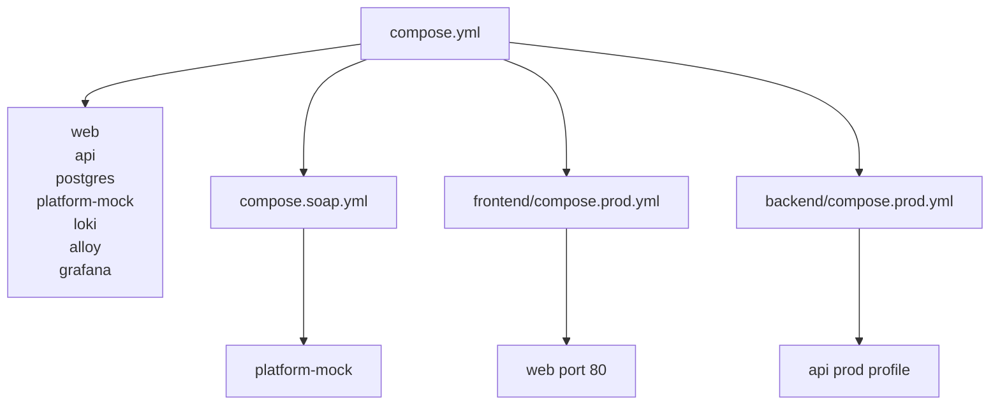
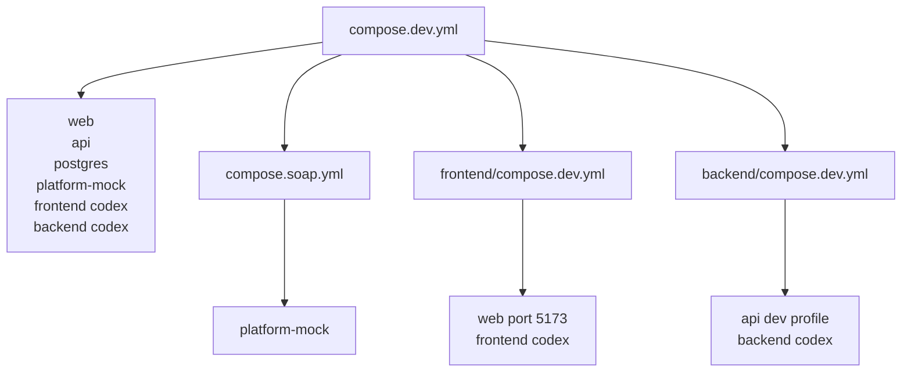
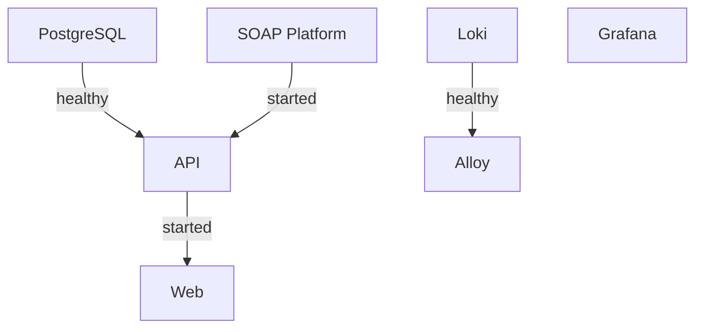

# Deployment

This document describes the project's deployment setup using Docker Compose.

The application provides separate development and production deployments for the frontend, backend, database, SOAP mock, and observability services. It also explains the design decisions and trade-offs behind the deployment configuration.

## Architecture

The deployment is organized into root Docker Compose files that include frontend, backend, and SOAP platform Compose files. This structure avoids duplicating shared infrastructure while allowing each environment to define only its additional services and configuration.





Both environments deploy the same frontend and backend Docker images, with backend runtime behavior determined by the active Spring profile and injected environment variables. The root production deployment includes the observability stack.

## Frontend

### Image

The frontend application is packaged as a multi-stage Docker image. The build stage installs Node.js dependencies and produces the Vite production build. The final stage uses Nginx to serve the static frontend assets.

### Runtime

The Nginx runtime serves the single-page application and proxies `/api/` requests to the backend service through the `API_UPSTREAM` environment variable.

## Backend

### Image

The backend application is packaged as a multi-stage Docker image to minimize the size of the final runtime image. The application JAR is assembled before the Docker image is built, and the Docker build stage uses the Eclipse Temurin JDK to inspect the JAR and construct a custom Java runtime. The final stage contains only the generated runtime and the application JAR.

### Runtime

The custom runtime is generated using `jdeps` and `jlink` to include only the Java modules required by the application. This reduces the size of the final image, decreases the attack surface by excluding unnecessary runtime components, and avoids shipping a full JDK in production.

## Codex

The development deployment includes OpenAI Codex assistant containers for the frontend and backend workspaces.

The assistants are intentionally configured for narrowly scoped roles within the project, providing isolated environments optimized for repository analysis and implementation while leaving architectural decisions to the developer.

### Image

The Docker images package OpenAI Codex together with the tooling required to analyze, modify, and test the project. Unlike the application images, these images are intended exclusively for local development and are not part of the production deployment.

The images include the dependencies required to provide controlled execution environments for development tasks. They include module-specific development dependencies such as:

- **OpenJDK** — executes Gradle builds and the project's automated test suite
- **Git** — enables repository inspection and code review tasks
- **Node.js** — provides the runtime required by the Codex CLI
- **Codex CLI** — performs repository analysis, code generation, and review
- **Gosu** — drops root privileges before launching Codex

The images also provide a custom entrypoint that initializes the runtime environment before launching Codex. During startup, it ensures that the persistent home directory is owned by the configured unprivileged user, provisions the default Codex configuration on first use, and then drops root privileges before executing the assistant. This prevents root-owned generated files while allowing Codex to maintain its persistent runtime state across container executions.

### Workspace

The Codex workspaces intentionally expose only the subset of each module required to perform testing and code review tasks. Source code, build logic, package configuration, Gradle configuration, and task definitions are mounted into the containers, while unrelated project files remain inaccessible.

The selective workspaces reduce the amount of repository content that Codex must analyze, improving context fidelity and keeping development tasks focused on the code under review. Files that Codex is expected only to inspect, such as task definitions and generated API/mock inputs, are mounted read-only, while source code, documentation, build logic, and local helper scripts remain writable to allow implementation of code changes.

### Environment

Codex is configured to operate without interactive approval prompts and with unrestricted workspace access. The configuration minimizes interruptions during development tasks and avoids the limitations of the CLI's built-in sandbox. 

Since each assistant executes as an unprivileged user inside a dedicated development container with a deliberately restricted workspace, this trade-off provides a more efficient development workflow without increasing exposure beyond the intended scope.

## Configuration

The application images are configured through environment variables, allowing the same images to be deployed in different environments without modification. Runtime settings such as frontend API upstream, backend database connectivity, cryptographic secrets, SOAP endpoint, and the active Spring profile are supplied by the corresponding Docker Compose configuration.

The root production-style deployment intentionally configures the SOAP platform endpoint to use the provided mock platform for the assignment. Standalone backend production deployment requires `SOAP_ENDPOINT` to be supplied externally and should point to the actual SOAP platform.

## Commands

The root project provides Just recipes for building and deploying the complete stack.

Production-style local deployment:

```shell
just deploy
```

Development deployment:

```shell
just compose-dev up -d
```

Redeploy production-style local stack:

```shell
just redeploy
```

## Observability

### Logging

The production deployment includes an observability stack consisting of Grafana, Loki, and Alloy. Alloy collects structured logs from Docker containers, enriches them with additional metadata, and forwards them to Loki for centralized storage.

Loki and Alloy are exposed without fixed host ports. Grafana is exposed to the host to provide access to dashboards and log exploration during local deployment.

### Dashboards

The project includes two provisioned Grafana dashboards that provide complementary views of the deployed application and its observability infrastructure.

The **Docker** dashboard provides an infrastructure-level overview of the deployment. It contains a dedicated panel for each Docker Compose service, allowing container logs to be monitored from a single dashboard. This view is primarily intended to verify that all services are operating correctly and to assist in diagnosing deployment and infrastructure issues.

The **Backend** dashboard provides multiple views of application's structured logs:

- **Server Logs** present the formatted application logs emitted by Spring Boot
- **Container Logs** display the raw structured JSON log records collected from the backend container, exposing all emitted log fields for inspection
- **Application Logs** provide a simplified operational view focused on application messages while reducing implementation-specific details
- **Event Logs** display high-level application events together with shortened trace identifiers, allowing related log entries to be correlated and execution flows to be followed across synchronous and asynchronous processing

### Provisioning

Grafana is automatically provisioned with the required data sources and dashboards, allowing the logging stack to be used immediately after deployment.

The `just/scripts/grafana-export.sh` script exports all dashboards through the Grafana HTTP API and stores them in `docker/grafana/dashboards`. Dashboards are exported in the classic JSON format and named according to their Grafana dashboard UID, allowing them to be version-controlled and automatically provisioned in subsequent deployments.

## Health Checks

Health checks are configured to verify service availability and coordinate container startup through Docker Compose.

The following services define health checks:

- **PostgreSQL** ensures database is accepting connections before other services start
- **Backend** uses Spring Boot Actuator endpoint to verify platform availability
- **Loki** verifies that the log storage service is ready before Alloy begins forwarding logs



Note that Grafana intentionally does not define a health check. The selected distroless image does not include the tooling required to implement one, and no other service depends on it during startup.

## Notes

- The project currently uses local `hr-telekom/wifi-admin-api:1.0.0` and `hr-telekom/wifi-admin-web:1.0.0` image tags for Docker Compose deployments. Future production deployments should instead use immutable versioned image tags produced by a CI/CD pipeline
- The web service is exposed on `80` in the root production-style deployment and on `5173` in the development deployment
- The backend (`8081`) and Actuator (`8082`) ports are intentionally exposed to the host to simplify local development and demonstration
- Loki and Alloy are not bound to fixed host ports; Grafana is exposed on `3000`
- A production deployment should place the application behind a reverse proxy and restrict access to management endpoints through network-level controls
