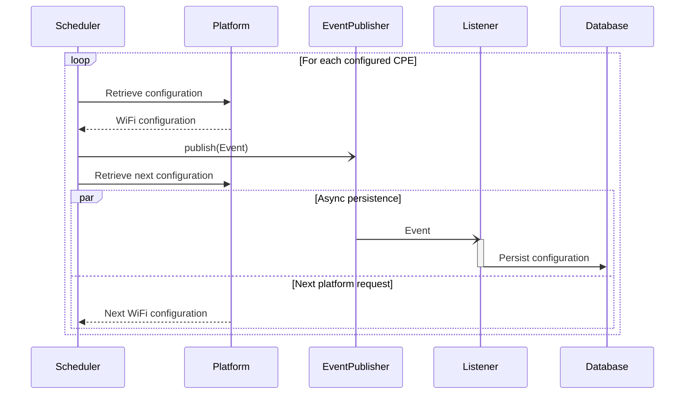
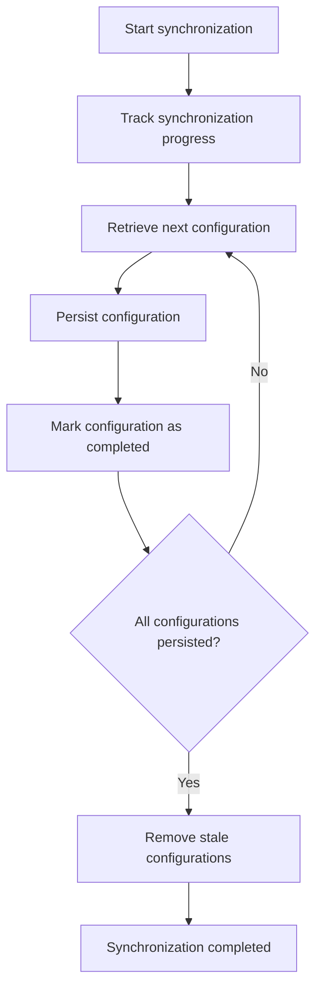
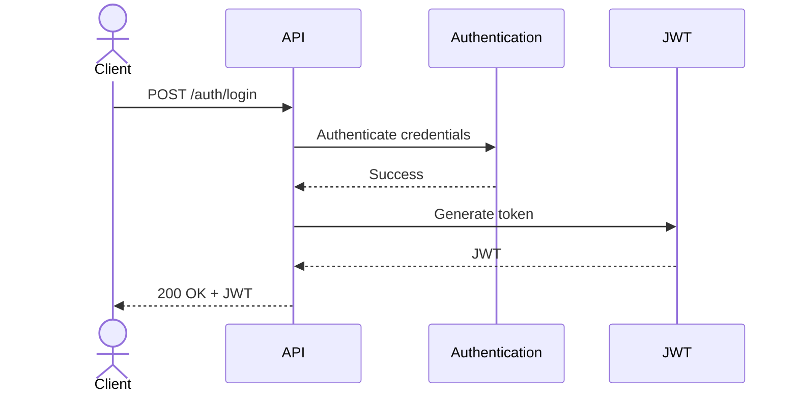
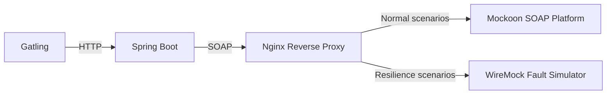

# Implementation

This document describes how the architecture defined in [ARCHITECTURE.md](ARCHITECTURE.md) is implemented. It documents the project's implementation decisions, technologies, and development conventions.

## Technology Stack

| Area          | Technology                                          |
|---------------|-----------------------------------------------------|
| Runtime       | Java 21, Spring Boot                                |
| API           | Spring Web                                          |
| API Contract  | OpenAPI                                             |
| Integration   | Apache CXF                                          |
| Data          | PostgreSQL, Spring Data JPA, Flyway                 |
| Validation    | Jakarta Bean Validation                             |
| Security      | Spring Security                                     |
| Logging       | SLF4J, Logback                                      |
| Observability | Spring Boot Actuator, Micrometer                    |
| Testing       | JUnit 5, Mockito, Testcontainers, ArchUnit, Gatling |
| Deployment    | Docker, Docker Compose                              |

## Project Structure

The project is organized into top-level packages that reflect the logical architecture. Each package corresponds to a single architectural module and groups related implementation concerns.

### Modules

```text
src/main/java
└── hr
    └── ht
        └── rnd
            └── wifiadmin
                ├── application
                ├── common
                ├── domain
                └── infra
```

| Package       | Responsibility                              |
|---------------|---------------------------------------------|
| `application` | Use cases, application services, and ports  |
| `domain`      | Domain model and business rules             |
| `infra`       | REST, SOAP, persistence, and configuration  |
| `common`      | Shared utilities and cross-cutting concerns |

### Application Structure

The application module follows the **Ports and Adapters** architecture.

```text
application
├── inbound
├── outbound
└── service
```

| Package    | Responsibility                                                  |
|------------|-----------------------------------------------------------------|
| `inbound`  | Defines the application's public capabilities                   |
| `outbound` | Defines the application's required external capabilities        |
| `service`  | Implements capabilities and orchestrates business operations    |

## Platform Integration

The application integrates with the external WiFi platform using Apache CXF. SOAP client classes are generated directly from the published WSDL and confined to the integration layer, where they are translated into the domain model through dedicated mappers.

The SOAP client is configured with connection and read timeouts. Additional client configuration ensures compatibility with the target platform by preferring HTTP/1.1 transport and explicit namespace prefixes. Transient communication failures are handled using Resilience4j with a configurable retry policy and exponential backoff strategy.

SOAP faults and transport exceptions are translated into domain-specific exceptions before leaving the integration layer.

## Persistence

WiFi configurations are persisted in PostgreSQL using Spring Data JPA. Database schema changes are managed through Flyway versioned migrations.

The application maintains a local replica of the WiFi configurations stored in the external platform. Repository operations are encapsulated behind application ports, allowing the persistence implementation to remain isolated from the application layer.

Retrieved configurations are served from the local database when available and fall back to the external platform on cache misses or repository failures. Successful platform interactions publish application events that are handled asynchronously to persist retrieved or updated configurations to the local database. This keeps orchestration services focused on communicating with the external platform while allowing persistence and other follow-up processing to execute independently without delaying client responses.

## Synchronization

### Execution

Synchronization is implemented using Spring Scheduling with a configurable execution schedule and set of synchronized devices. Platform configurations are retrieved sequentially and published as application events. Persistence and other follow-up processing execute asynchronously, allowing the scheduler to continue retrieving the next configuration without waiting for local processing to complete.

This event-driven approach provides a natural extension point for additional processing, such as metrics collection, audit logging, or notifications.



Platform requests are intentionally performed one at a time to keep synchronization predictable and avoid making assumptions about the external platform's ability to handle concurrent requests. If higher synchronization throughput is ever required, concurrent retrieval can be introduced later without changing the overall workflow.

### Consistency

To prevent stale configurations from being removed after a partially completed synchronization, synchronized configurations are tracked until all persistence operations complete successfully. Only then are configurations missing from the current synchronization removed from the local database.



### Observability

Synchronization activity is instrumented through Micrometer metrics and structured logging, enabling synchronization duration, success and failure counts, persistence latency, and retry activity to be monitored in production.

## Configuration

Application configuration is externalized to support environment-specific deployments. Common settings are defined in the default configuration, while environment-specific overrides are organized into separate configuration files:

- `application.properties` — common configuration
- `application-dev.properties` — local development
- `application-test.properties` — automated testing

Sensitive configuration is supplied through environment variables rather than being stored in source control. Examples include:

- Database credentials
- JWT signing secrets
- External platform endpoints
- Retry policy
- Synchronization schedule

Containerized deployments provide environment-specific configuration through Docker Compose, including:

- Database connection settings
- External platform endpoints
- JWT signing secrets
- Active Spring profile

## Exception Handling

Platform and application exceptions are translated into REST error responses by a global exception handler.

### Validation Failures

The following validation failures result in a `400 Bad Request` response:

- **Request parsing:** malformed JSON, invalid enum values, type mismatches
- **Bean validation:** missing required fields, blank values, constraint violations
- **Business validation:** missing password for encrypted Wi-Fi, other invalid configuration combinations

### Resource Not Found

An unknown `cpeId` results in a `404 Not Found` response.
  
### Platform Integration Failures

The following platform integration failures result in a `502 Bad Gateway` response:

- **SOAP faults:** platform-reported errors
- **Network timeouts:** request timeouts while communicating with the SOAP platform
- **Other communication failures:** transport-level communication errors
  
### Unexpected Exceptions

Any unhandled exception results in a `500 Internal Server Error` response.
  
### Error Response Model

All error responses use the common `ErrorBody` model defined by the OpenAPI specification. This model is also used for `500` error responses.

```json
{
  "message": "string",
  "code": "string"
}
```

| Field     | Description                              |
|-----------|------------------------------------------|
| `message` | Human-readable description of the error. |
| `code`    | Application-specific error identifier.   |

## Security

The application secures the REST API using Spring Security with JWT-based authentication. Clients authenticate by submitting their credentials to the authentication endpoint. Upon successful authentication, the application issues a signed JWT, which clients present in the `Authorization` header when accessing protected endpoints.



Authentication and authorization are performed within the application. Access to protected endpoints is restricted to authenticated users with the `ADMIN` role.

## Observability

### Logging

The application uses SLF4J with Logback to produce **structured application logs** suitable for centralized log aggregation and analysis.

Operational events are logged at the following severity levels:

- **TRACE** – Low-level protocol details, such as SOAP request and response payloads
- **DEBUG** – Diagnostic information, such as outbound SOAP interactions
- **INFO** – Successful operations, such as retrieving or updating Wi-Fi configurations
- **WARN** – Recoverable issues, such as missing resources
- **ERROR** – Unexpected failures, such as network or platform errors

Log entries include contextual information, such as the operation, CPE identifier, and correlation ID, to support request tracing.

Sensitive information, including Wi-Fi passwords, user passwords, JWTs, and authorization headers, is never written to the logs. Where appropriate, sensitive values are partially obfuscated for troubleshooting.

### Health & Metrics

The application uses custom health indicators to verify the availability of PostgreSQL and the external SOAP platform. Micrometer is used to expose standard Spring Boot metrics together with the following application-specific metrics:

- SOAP request latency
- Retry count
- Synchronization duration
- Synchronization success and failure counts

## Testing

### Unit Tests

Unit tests are implemented using JUnit 5 and Mockito. They execute without a Spring context and verify business logic, validation, mapping, and error handling in isolation.

### Integration Tests

Integration tests execute against production-like infrastructure using Testcontainers. A PostgreSQL container is provisioned automatically for each test run, while the provided SOAP platform mock is used to verify interactions between the REST API, database, and external platform.

### Architecture Tests

Architecture tests are implemented using ArchUnit to verify package structure, dependency rules, and architectural boundaries.

### Resilience Tests

Resilience tests are implemented as end-to-end system tests using Gatling against the containerized application stack. They verify the application's behavior under transient platform failures, including retry logic, exponential backoff, and timeout handling.

The external SOAP platform is accessed through an Nginx reverse proxy. During normal test execution, requests are forwarded to the reference Mockoon platform. During resilience scenarios, Nginx routes requests to a dedicated WireMock instance that simulates transient failures such as timeouts and temporary server errors.



This approach validates the application's resilience under realistic runtime conditions without modifying either the application or the reference SOAP platform. Fault scenarios are isolated within the test environment, allowing retry and recovery behavior to be verified against the complete containerized stack.
