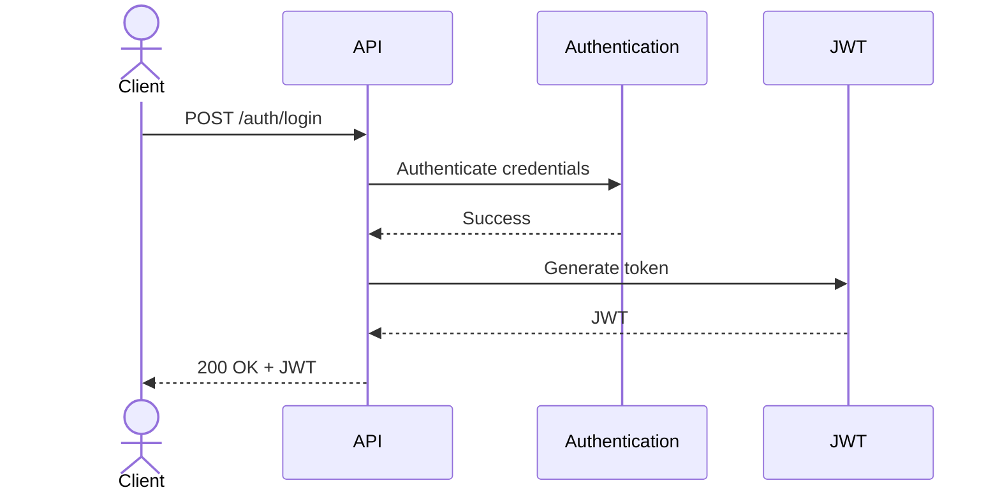
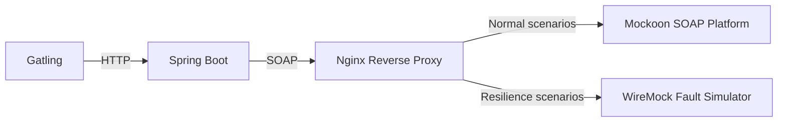

# Implementation

This document describes how the architecture defined in [ARCHITECTURE.md](ARCHITECTURE.md) is implemented. It documents the project's implementation decisions, technologies, and development conventions.

## Technology Stack

| Area          | Technology                                          |
|---------------|-----------------------------------------------------|
| Runtime       | Java 21, Spring Boot                                |
| API           | Spring Web                                          |
| API Contract  | OpenAPI                                             |
| Integration   | Apache CXF                                          |
| Data          | PostgreSQL, Spring Data JPA, Flyway                 |
| Validation    | Jakarta Bean Validation                             |
| Security      | Spring Security                                     |
| Logging       | SLF4J, Logback                                      |
| Observability | Spring Boot Actuator, Micrometer                    |
| Testing       | JUnit 5, Mockito, Testcontainers, ArchUnit, Gatling |
| Deployment    | Docker, Docker Compose                              |

## Project Structure

The project is organized into separate top-level packages for the **WiFi Administration** bounded context, shared abstractions, and infrastructure. This structure reflects the architectural module boundaries while keeping implementation concerns isolated.

```text
src/main/java
├── wifi
│   ├── api
│   ├── internal
│   └── model
├── common
└── infra
```

| Package         | Responsibility                      |
|-----------------|-------------------------------------|
| `wifi`          | WiFi Administration bounded context |
| `wifi.api`      | Public API and contracts            |
| `wifi.internal` | Internal implementation             |
| `wifi.model`    | Domain model                        |
| `common`        | Shared abstractions and contracts   |
| `infra`         | Infrastructure implementations      |

## Platform Integration

The application integrates with the external WiFi platform using Apache CXF. SOAP client classes are generated from the provided WSDL and confined to the integration layer.

The SOAP client is configured with connection and read timeouts. Transient communication failures are handled using Resilience4j with a configurable retry policy and exponential backoff strategy.

SOAP faults and transport exceptions are translated into domain-specific exceptions before leaving the integration layer.

## Persistence

WiFi configurations are persisted in PostgreSQL using Spring Data JPA. Database schema changes are managed through Flyway versioned migrations.

The application maintains a local replica of the WiFi configurations stored in the external platform. Retrieved configurations are persisted locally, while configuration updates are written to the database only after they have been successfully applied on the platform.

## Configuration

Application configuration is externalized to support environment-specific deployments. Common settings are defined in the default configuration, while environment-specific overrides are organized into separate configuration files:

- `application.properties` — common configuration
- `application-dev.properties` — local development
- `application-test.properties` — automated testing

Sensitive configuration is supplied through environment variables rather than being stored in source control. Examples include:

- Database credentials
- JWT signing secrets
- External platform endpoints
- Retry policy
- Synchronization schedule

Containerized deployments provide environment-specific configuration through Docker Compose, including:

- Database connection settings
- External platform endpoints
- JWT signing secrets
- Active Spring profile

## Exception Handling

Application exceptions are translated into REST error responses by a global exception handler, ensuring consistent error handling across all API endpoints.

The global exception handler is responsible for translating validation failures, platform integration failures, and unexpected exceptions into the application's standard error response model.

## Security

The application secures the REST API using Spring Security with JWT-based authentication. Clients authenticate by submitting their credentials to the authentication endpoint. Upon successful authentication, the application issues a signed JWT, which clients present in the `Authorization` header when accessing protected endpoints.



Authentication and authorization are performed within the application. Access to protected endpoints is restricted to authenticated users with the `ADMIN` role.

## Logging

The application uses SLF4J with Logback to produce structured JSON logs suitable for centralized log aggregation and analysis.

Incoming HTTP requests, outgoing SOAP requests, retry attempts, unexpected exceptions, and synchronization summaries are logged to provide operational visibility. Every request is assigned a unique correlation ID that is propagated throughout the application and included in all related log entries.

Sensitive information, including WiFi passwords, user passwords, JWTs, and authorization headers, is partially obfuscated before being written to the logs to support troubleshooting while preventing disclosure of sensitive data.

## Observability

The application uses Spring Boot Actuator and Micrometer to expose operational health information and application metrics.

Custom health indicators verify the availability of PostgreSQL and the external SOAP platform. In addition to the standard Spring Boot metrics, the application exposes the following application-specific metrics:

- SOAP request latency
- Retry count
- Synchronization duration
- Synchronization success and failure counts

## Testing

### Unit Tests

Unit tests are implemented using JUnit 5 and Mockito. They execute without a Spring context and verify business logic, validation, mapping, and error handling in isolation.

### Integration Tests

Integration tests execute against production-like infrastructure using Testcontainers. A PostgreSQL container is provisioned automatically for each test run, while the provided SOAP platform mock is used to verify interactions between the REST API, database, and external platform.

### Architecture Tests

Architecture tests are implemented using ArchUnit to verify package structure, dependency rules, and architectural boundaries.

### Resilience Tests

Resilience tests are implemented as end-to-end system tests using Gatling against the containerized application stack. They verify the application's behavior under transient platform failures, including retry logic, exponential backoff, and timeout handling.

The external SOAP platform is accessed through an Nginx reverse proxy. During normal test execution, requests are forwarded to the reference Mockoon platform. During resilience scenarios, Nginx routes requests to a dedicated WireMock instance that simulates transient failures such as timeouts and temporary server errors.



This approach validates the application's resilience under realistic runtime conditions without modifying either the application or the reference SOAP platform. Fault scenarios are isolated within the test environment, allowing retry and recovery behavior to be verified against the complete containerized stack.
