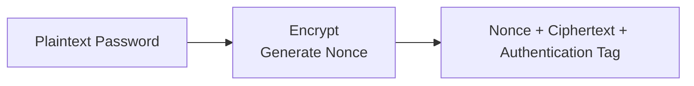
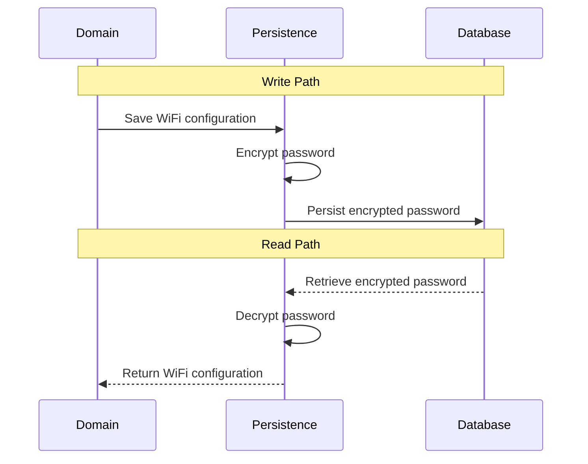

This document describes the implementation of password protection within the application. It covers password modeling, encryption, persistence, key management, logging, and error handling.

## Password Model

WiFi passwords are represented by a dedicated value object rather than a raw `String`. The value object encapsulates password validation and redacts its value from string representations to prevent accidental disclosure through logging or debugging.

The domain model operates exclusively on plaintext passwords. Encryption and decryption are performed transparently at the persistence boundary, keeping cryptographic concerns isolated from business logic.


## Encryption

WiFi passwords are encrypted before being persisted to the database and decrypted when retrieved. Each encryption operation generates a new random nonce and produces an authentication tag, ensuring both confidentiality and integrity while remaining transparent to the rest of the application.



### Algorithm

Passwords are encrypted using AES-256-GCM with a randomly generated 96-bit nonce and a 128-bit authentication tag. A new nonce is generated using `SecureRandom` for every encryption operation and is never reused with the same encryption key. This provides both confidentiality and integrity for persisted passwords.

### Ciphertext Format

Encrypted passwords are stored as versioned ciphertext in the format `enc:v1:<base64>`. The encoded payload contains the nonce, ciphertext, and authentication tag required for decryption. Versioning allows the encryption format to evolve without requiring database schema changes by allowing the decryptor to support multiple ciphertext versions while new passwords are encrypted using the latest format. Note that the current implementation supports only `enc:v1` ciphertext format.

```text
enc:v1:AbCdEfGhIjKlMnOpQrStUvWxYz...
│   │
│   └── Base64 encoded payload
└────── Ciphertext format version
```

The ciphertext is stored as text rather than binary to produce a self-describing, portable representation that can be safely backed up, migrated, and inspected across different systems. This slightly increases storage size due to Base64 encoding but avoids introducing a binary persistence format for relatively small password values.

### Key Management

The encryption key is externalized through application configuration and supplied via environment variables. It is never stored in source control or persisted alongside encrypted passwords.

```properties
wifi-admin.security.aes-key=${AES_KEY}
```

## Persistence

Encryption and decryption are performed transparently by the persistence layer. Passwords are encrypted before being written to the database and decrypted when retrieved, ensuring the domain model and application logic operate exclusively on plaintext values.



## Logging

Passwords are excluded from application logs, exception messages, and diagnostic output. The password value object redacts its value from string representations to prevent accidental disclosure during logging or debugging.

## Validation

Cryptographic inputs are validated before encryption and decryption to detect configuration errors and malformed data as early as possible.

- The encryption key is validated during application startup and must be a valid Base64-encoded 256-bit AES key
- Unknown ciphertext versions are rejected without attempting decryption
- Ciphertext format is validated before decryption
- Malformed or tampered ciphertext is rejected without attempting partial decryption
- Passwords are re-encrypted only when their plaintext value changes
